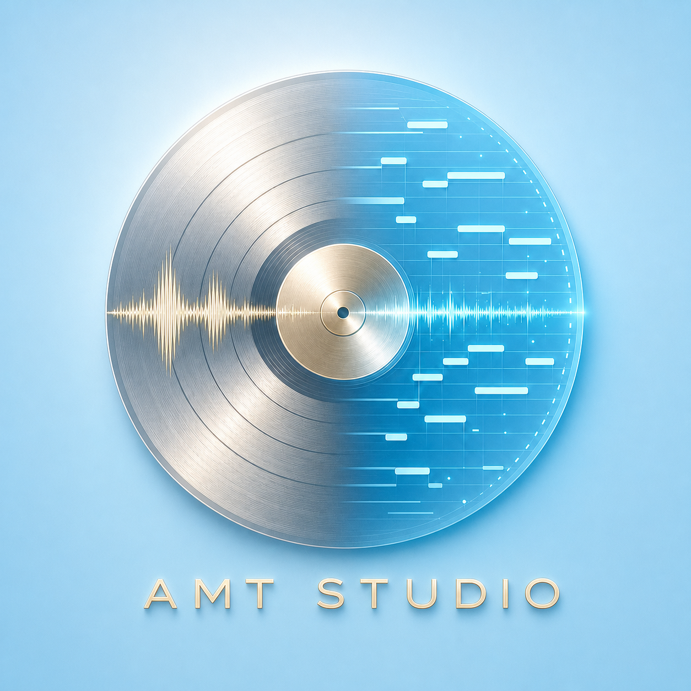

# AMT Studio

**把一首歌转换成可试听、可修改、可导出的多轨 MIDI，并额外提供可选的主旋律识别。**

**Turn a song into editable, playable, exportable multitrack MIDI, with an
optional dedicated main-melody transcription.**

AMT Studio 是一款面向 macOS 的自动音乐转录工作台。它把模型计算、任务管理、
多轨试听、钢琴卷帘编辑和 MIDI 导出放在同一个界面里，同时完整保留模型原始结果和
后续人工修改记录。

AMT Studio is a macOS automatic music transcription workspace that brings
model execution, job management, multitrack auditioning, piano-roll editing,
and MIDI export into one interface while preserving both raw model output and
subsequent user edits.

> 当前版本：**AMT Studio 0.2.0 Private Beta**
> Current release: **AMT Studio 0.2.0 Private Beta**



## 中文

### 它能做什么

- 一次导入一首或多首歌曲，并通过任务队列逐个提交、持续跟踪和自动取回结果。
- 默认使用 MuScriptor 生成完整多轨结果；也可单独使用 GAME large 生成一条主唱
  旋律候选轨。
- 在一个页面中查看所有音轨的音符分布，或进入单轨钢琴卷帘精确编辑。
- 同时试听原曲与 MIDI 合奏，逐轨调节音量、静音、独奏和启用状态。
- 拖动音符修改音高和位置，拖拽边缘修改长度，也可新增或删除音符。
- 估算速度、拍号和小节位置，在时间轴上同时显示秒数与拍号参考。
- 检测主旋律长时间空缺，并把用户选择的一个或多个片段重新提交计算；新候选不会
  静默覆盖原始结果。
- 对各音轨执行可撤销的延音碎片修复，并保存人工修改。
- 在同一歌曲的不同识别版本之间复制、合并或删除音轨，也可把音轨复制到另一首歌，
  保持原始时间不被裁剪。
- 导出当前音轨、当前试听合奏或完整识别版本的标准 MIDI。
- 查看 Hyak 上兼容 GPU 的只读资源快照、自己的排队状态和 Slurm 预计启动时间。

### 三步使用

1. 在 AMT Studio 中选择一首或多首音频，并选择“完整多轨”或可选的 GAME 主旋律。
2. 选择 Hyak GPU 或实验性的本机计算模式，等待软件提交、跟踪并取回结果。
3. 试听各轨、修正需要调整的音符，然后导出单轨或完整多轨 MIDI。

### 计算方式

AMT Studio 的 Mac 应用负责轻量工作：导入、队列、进度、试听、编辑、保存和导出。
较大的模型默认通过用户自己的 Hyak/Slurm 权限在计算节点运行；软件不会在 Hyak
登录节点执行模型。Hyak 资源页面只使用 `sinfo`、当前用户的 `squeue` 和
`sbatch --test-only`，不会提交占位任务或占用 GPU。

仓库不包含任何人的 Hyak 账号、密码、Duo 信息、私人存储路径或 SSH 会话。每位
使用者必须在 Terminal 中使用自己的账号完成登录，并在本机创建被 Git 忽略的
`configs/local_hyak.json`。本机 CPU/Apple GPU 路径已经提供，但模型环境仍属于
实验性配置，不是当前发布包的一键离线模式。

### 安装与运行

当前 Release 是面向开发者和测试者的 Private Beta，而不是经过 Apple 公证的
独立安装包。需要：

- Apple Silicon Mac，macOS 14 或更高版本；
- [Homebrew](https://brew.sh/)、`uv`、`ffmpeg` 和 `ffprobe`；
- 若使用 Hyak：使用者自己的 SSH、Duo、Slurm 权限以及所需的合法模型资源。

```bash
git clone https://github.com/Wenshuishi0528/amt-studio.git
cd amt-studio
./scripts/bootstrap_mac.sh
make check
make mac-app
open "apps/AMTStudioMac/dist/AMT Studio.app"
```

Release 附件中的 macOS 应用仍需要与仓库源码和轻量 Python 后台配套使用。首次公开
测试建议从仓库目录构建；应用没有经过 Apple Developer ID 公证，macOS 可能显示
安全提示。

### 结果应如何理解

自动识谱不是无误的“音频转乐谱”。当前模型可能漏掉较弱音符、把正确音符分到错误
乐器、产生多余音符，或者把连续延音切成碎片。主观试听反馈不能替代正式准确率。
因此 AMT Studio 的设计重点是：

- 原始多轨永远保留；
- 自动增强和人工修改生成可追溯的新版本；
- 用户可以直接试听、比较、纠正和撤销；
- 不把未知置信度冒充低置信度，也不把空白自动判定为模型错误。

人工修改目前只会改善当前项目的导出，不会自动训练模型或让下一首歌立刻变准。

### 隐私与许可证

公开仓库只包含源码、测试、结构定义和文档，不包含私人歌曲、转录结果、数据集、
模型权重、账号凭据或集群日志。音频和生成结果默认保存在 Git 忽略的本地目录。

本项目尚未选择开源许可证；在许可证明确之前，项目原创代码保留所有权利。第三方
模型、权重和数据集继续受各自许可证约束。详见
[LICENSE_NOT_SELECTED.md](LICENSE_NOT_SELECTED.md) 和
[AUTHORIZATION_AND_PROVENANCE.md](docs/AUTHORIZATION_AND_PROVENANCE.md)。

## English

### What it does

- Imports one or many songs, queues them, tracks their jobs, and retrieves
  completed results.
- Uses MuScriptor for the default full multitrack transcription, with an
  optional GAME large route for a dedicated lead-vocal melody candidate.
- Shows every product track in an all-track note overview and provides a
  detailed single-track piano-roll editor.
- Auditions source audio and MIDI together, with per-track volume, mute, solo,
  and enable controls.
- Moves and resizes notes by dragging, and supports explicit note creation and
  deletion.
- Estimates tempo and meter and shows both seconds and bar/beat references.
- Detects long melody-coverage gaps and resubmits one or many user-selected
  regions without silently overwriting the raw result.
- Applies undoable, per-track repair for fragmented sustained notes and saves
  user corrections.
- Copies, merges, or removes tracks across recognition versions, including
  cross-song copying that preserves the source timeline without clipping.
- Exports the selected track, the current audible arrangement, or the complete
  recognition version as standard MIDI.
- Shows a read-only Hyak capacity snapshot, owner-scoped queue counts, and
  Slurm test-only start estimates for compatible GPUs.

### Three-step workflow

1. Choose one or more audio files and select either full multitrack recognition
   or the optional GAME melody route.
2. Select Hyak GPU compute or the experimental local mode, then let AMT Studio
   submit, monitor, and retrieve the work.
3. Audition tracks, correct the notes that need attention, and export one track
   or the complete multitrack MIDI.

### Compute model

The Mac application handles lightweight work: import, queueing, progress,
playback, editing, persistence, and export. Large-model inference defaults to
compute nodes reached through the operator's own Hyak/Slurm access; model work
never runs on a Hyak login node. The capacity view only uses `sinfo`,
owner-scoped `squeue`, and `sbatch --test-only`. It does not create placeholder
jobs or reserve GPUs.

The repository contains no personal Hyak username, password, Duo information,
private storage path, or SSH session. Each operator must authenticate in
Terminal with their own account and create the Git-ignored
`configs/local_hyak.json` locally. An experimental local CPU/Apple GPU route
exists, but its model environment is not yet a one-click offline package.

### Install and run

This Release is a developer/tester-oriented Private Beta, not a notarized
standalone installer. Requirements:

- Apple Silicon Mac with macOS 14 or later;
- [Homebrew](https://brew.sh/), `uv`, `ffmpeg`, and `ffprobe`;
- for Hyak mode: the operator's own SSH, Duo, and Slurm access plus legally
  obtained model assets.

```bash
git clone https://github.com/Wenshuishi0528/amt-studio.git
cd amt-studio
./scripts/bootstrap_mac.sh
make check
make mac-app
open "apps/AMTStudioMac/dist/AMT Studio.app"
```

The macOS artifact attached to the Release still works together with the
repository source and lightweight Python backend. Building from the checkout
is recommended for the first public test. The app is not Apple Developer ID
notarized, so macOS may display a security warning.

### How to interpret results

Automatic music transcription is not error-free audio-to-score conversion.
Current models may omit quiet notes, assign correct notes to the wrong
instrument, emit extra notes, or fragment a sustained tone. Subjective
listening feedback is not a formal accuracy measurement. AMT Studio therefore
focuses on:

- preserving every raw multitrack result;
- creating traceable derived versions for automatic and manual corrections;
- making comparison, correction, and undo directly accessible;
- never treating unknown confidence as low confidence or every silent region
  as a model failure.

Manual edits currently improve only the active project's export. They do not
automatically retrain the model or make the next song more accurate.

### Privacy and licensing

The public repository contains source code, tests, schemas, and documentation
only. It excludes private songs, transcriptions, datasets, model weights,
credentials, and cluster logs. Audio and generated artifacts remain in
Git-ignored local directories by default.

No open-source license has been selected. Until one is explicitly added, the
project owner's original code remains all rights reserved. Third-party models,
weights, and datasets remain subject to their own terms. See
[LICENSE_NOT_SELECTED.md](LICENSE_NOT_SELECTED.md) and
[AUTHORIZATION_AND_PROVENANCE.md](docs/AUTHORIZATION_AND_PROVENANCE.md).

## Project documentation / 项目文档

- [STATUS.md](STATUS.md) — verified current state / 已验证的当前状态
- [CHANGELOG.md](CHANGELOG.md) — task-level change history / 任务级更新记录
- [HANDOFF.md](HANDOFF.md) — operating and handoff notes / 操作与交接说明
- [KNOWN_ISSUES.md](KNOWN_ISSUES.md) — research limitations and historical
  observations / 研究限制与历史观察
- [Archived pre-0.2.0 README](docs/archive/README_PRE_V0.2.0.md) — previous
  project introduction / 旧版项目简介备份

---

AMT Studio 0.2.0 Private Beta · `wenshuishi26`
